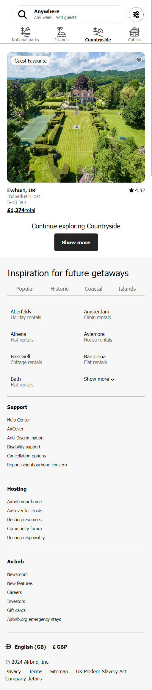

 

# Pre-bootcamp Warm-up
The purpose of this project is to keep the bootcampers' HTML and CSS skills sharp by aiming to create a copy of the Airbnb homepage user interface, following the First-Mobile-Design methodology, utilizing HTML and CSS.

  ## Table of Content 
- [Configuration](#Configuration)
- [Visuals](#Visuals)
- [Links](#Links)
- [Credits](#Credits)
- [License](#License)
- [Questions](#Questions)

## Configuration 
Below are some possible options to use in building this project. 

Click [HERE](https://getbootstrap.com/docs/5.3/getting-started/introduction/) to see instruction on how to add bootstrap compiler.

Click [HERE](https://www.w3schools.com/icons/fontawesome_icons_intro.asp) to see instruction on how to add Font-awesome toolkit.

## Visuals

#### Image of the project on 425px min-width mobile viewport.

#### Short video clip of the project on mobile phone.

https://github.com/chari00/Pre-bootcamp-warm-up/assets/116744496/9066d94f-4b6a-475f-847b-0ff26dbb979e

## Links

### Deployed website URL
- https://chari00.github.io/Pre-bootcamp-warm-up/  

### Project source code location
- https://github.com/chari00/Pre-bootcamp-warm-up  

### URL for resources
- https://getbootstrap.com/docs/5.3/getting-started/introduction/ 
- https://www.w3schools.com/icons/fontawesome_icons_intro.asp 
- https://developer.mozilla.org/en-US/docs/Web/CSS/:hover 
- https://www.w3schools.com/cssref/pr_text_text-decoration.php 

## Credits
Credits to [Airbnb public website](https://www.airbnb.co.uk/) team.

## License
This project is covered by  .

## Questions
For questions and comments please contact the following details:

E-mail: macharitocruzuk@gmail.com
  
